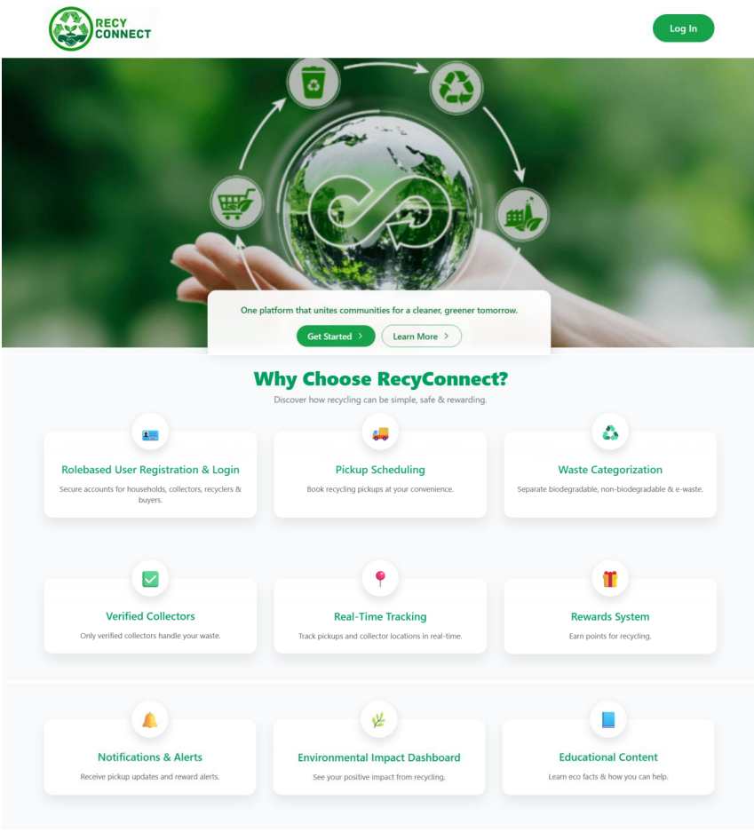
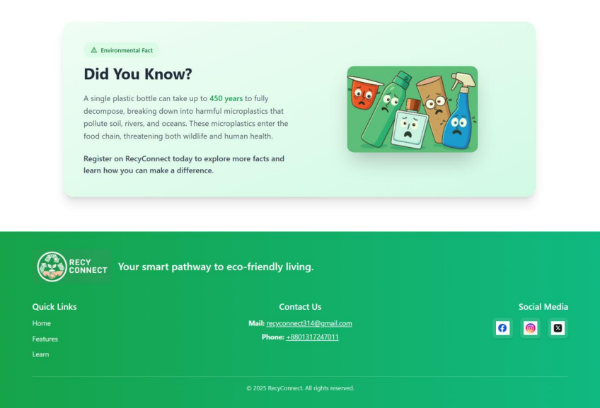
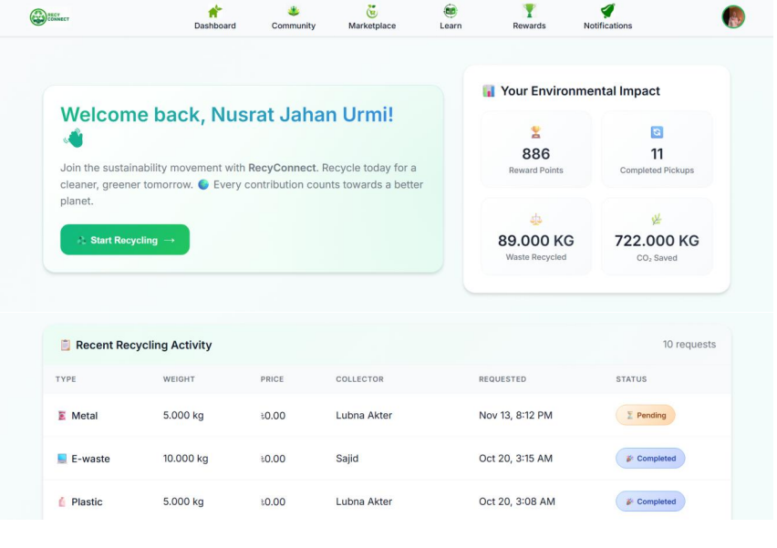
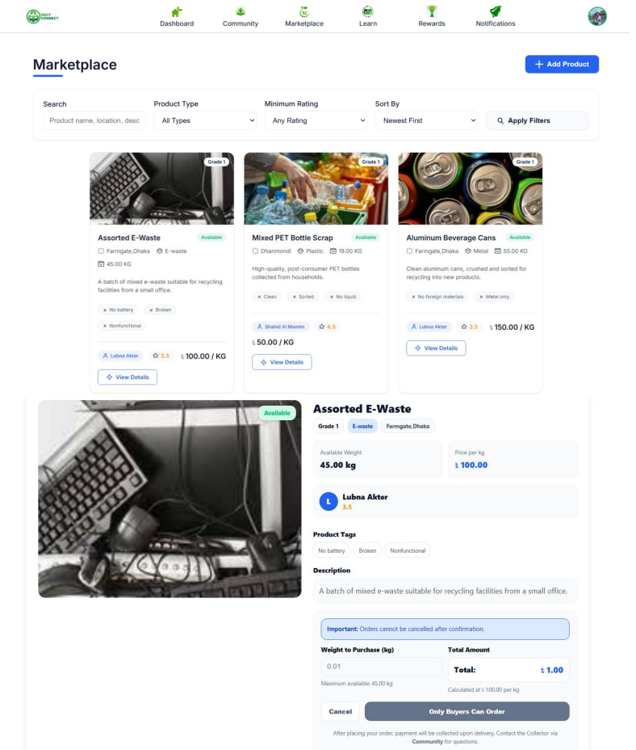
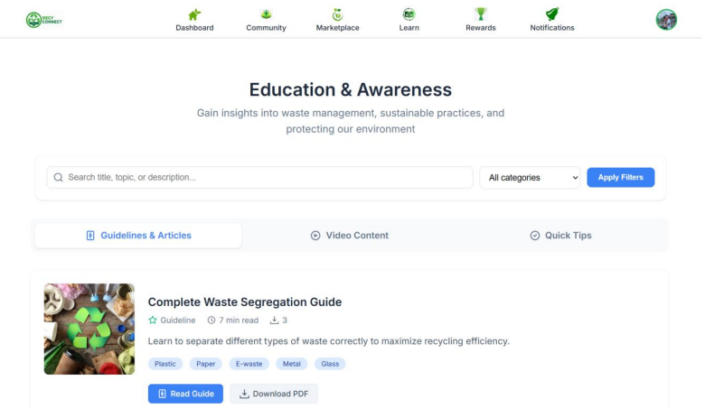
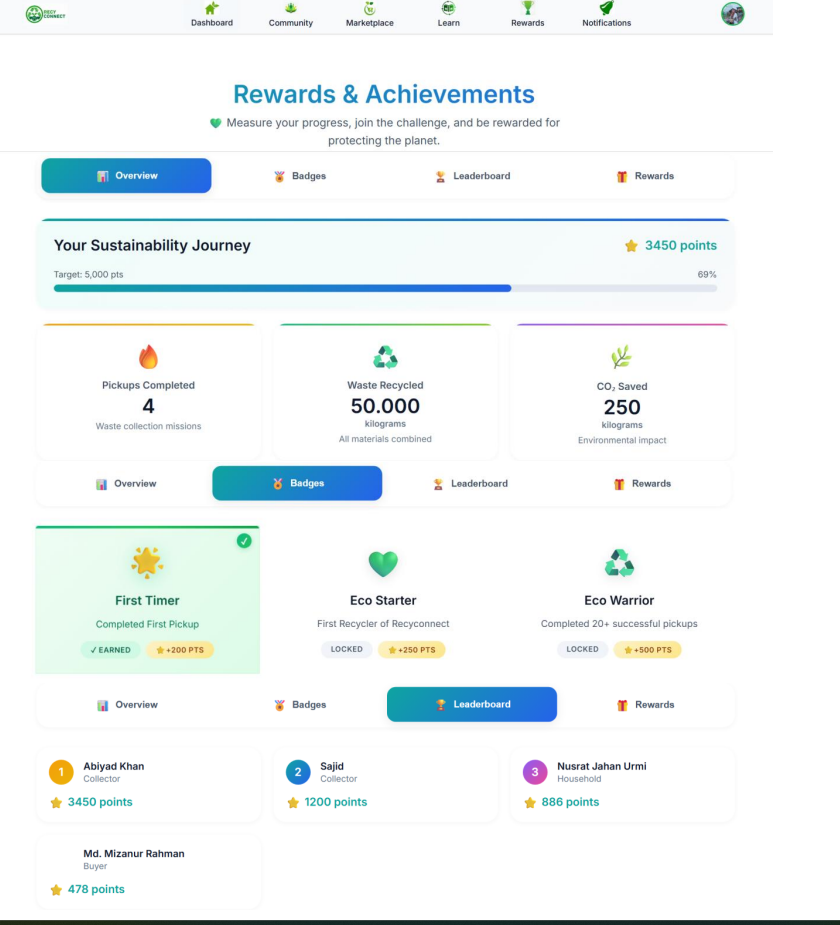
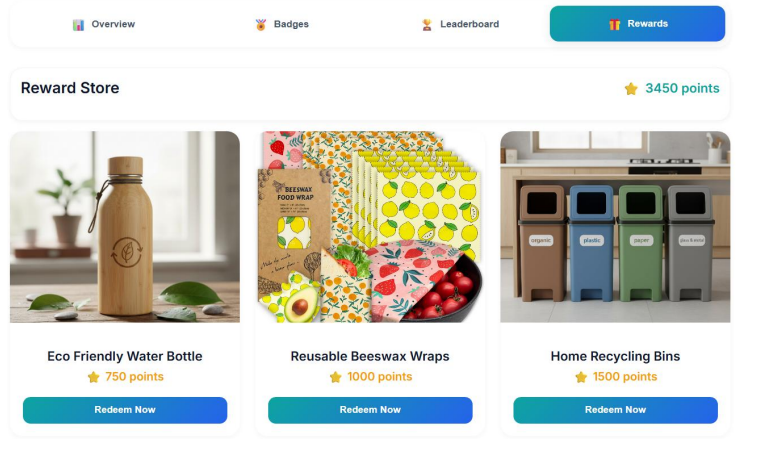

<p align="center">
  
  
  
</p>

# ♻️ RecyConnect  
### Your Smart Pathway to Eco-Friendly Living

<p align="center">
  
</p>

RecyConnect is a **smart, role-based waste management and recycling platform** designed to connect households, waste collectors, recycling centers, and buyers through a centralized digital system.  
The platform promotes **sustainability, transparency, and structured recycling** to address Bangladesh’s growing waste management challenges.

---

## 📌 Project Overview
- **Project Type:** Web-based Recycling Platform  
- **Domain:** Environmental Sustainability, Smart Waste Management  
- **Course:** CSE 314 – Software Engineering Lab  
- **Institution:** University of Asia Pacific  

---

## 🎯 Problem Statement
Urban and semi-urban regions in Bangladesh lack an organized recycling ecosystem.  
Households struggle with proper waste segregation, collectors face logistical inefficiencies, and recyclable materials often end up in landfills.  
RecyConnect solves this by introducing a **technology-driven, transparent, and community-centric solution**.

---

## 🚀 Core Features
- Role-based dashboards (Household, Collector, Buyer, Admin)
- Smart pickup scheduling system
- Verified collector profiles for trust & safety
- Recycling awareness & learning modules
- Recyclable material marketplace
- Real-time notifications & status tracking
- Gamification with rewards & eco-points
- Admin monitoring & reporting system

---

## 👥 User Roles
| Role | Responsibilities |
|-----|------------------|
| Household | Request pickups, learn recycling, earn rewards |
| Collector | Accept jobs, manage pickups, list materials |
| Buyer | View & purchase recyclable materials |
| Admin | Verify users, monitor activities, generate reports |

---

## 🛠 Technology Stack
| Layer | Technology |
|------|-----------|
| Frontend | HTML, CSS, JavaScript, Tailwind CSS |
| Backend | Django (Python) |
| Database | SQLite |
| Architecture | MVT (Model-View-Template) |
| Testing | Selenium |
| Design | Figma |

---

## 🧩 System Architecture
RecyConnect follows the **Django MVT architecture**, ensuring:
- Separation of concerns  
- High scalability  
- Easy maintenance and extension  

---

## ▶️ Installation & Setup

```bash
git clone https://github.com/Nawmi02/RecyConnect.git
cd RecyConnect
python -m venv env
source env/bin/activate   # Windows: env\Scripts\activate
pip install -r requirements.txt
python manage.py migrate
python manage.py runserver
```


## ▶️ Access the Application
Access the application at:  
http://127.0.0.1:8000/


## 🖥️ User Interface Preview

### Landing Page
<p align="center">
  
  

</p>

### Dashboard View (Household)
<p align="center">
  
</p>

### Marketplace
<p align="center">
  
</p>

### Education
<p align="center">
  
</p>

### Rewards
<p align="center">
  
   
</p>


## 🔮 Future Enhancements
- Mobile application (Android / iOS)
- Map-based collector tracking
- SMS-based pickup requests for low-internet areas
- Automated payment & reward system
- Nationwide expansion across Bangladesh


## 👨‍💻 Development Team
- **Nashrah Zakir** (22201202) – Group Leader  
- Nusrat Jahan Urmi (22201214)  
- Arfatunnesa Humaira (22201217)  
- Lubna Akter (22201219)


## 📄 License
This project is developed for academic and educational purposes under  
**CSE 314 – Software Engineering Lab**.

---


